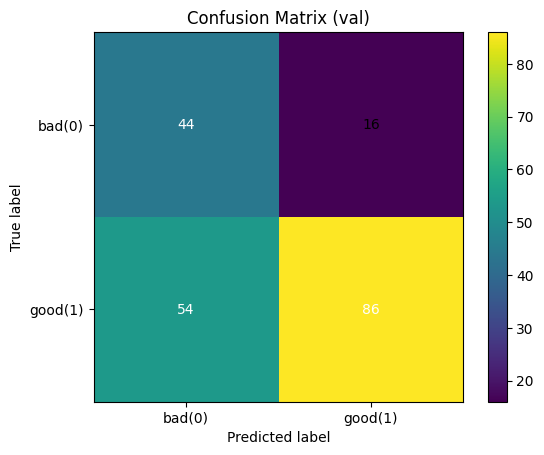

# Credit Scoring con PyTorch

Este proyecto implementa un modelo de **Credit Scoring** usando **redes neuronales profundas (MLP)** en PyTorch.  
El objetivo es predecir el **riesgo crediticio de clientes** a partir de variables demográficas y financieras, empleando un pipeline reproducible con MLflow, configuraciones en YAML y despliegue con Docker.

---

## Introducción

El sistema de Credit Scoring busca predecir si un cliente es un buen o mal pagador a partir de características demográficas y financieras.  
Este proyecto está desarrollado en Python usando PyTorch e integra prácticas modernas de MLOps con MLflow, configuración en YAML y despliegue con Docker.

---

## Estructura del proyecto

```
python/credit-scoring
├── artifacts/                  # Artefactos intermedios de entrenamiento
├── config/                     # Configuraciones en YAML
│   ├── credit_scoring-training_config-german_credit_risk_v100.yaml
│   └── credit_scoring-training_config-german_credit_risk_v110.yaml
├── datasets/                   # Datos de entrada (ejemplo: german_credit_risk.csv)
├── mlruns/                     # Experimentos registrados con MLflow
├── models/                     # Modelos y preprocesadores guardados
├── reports/                    # Resultados y métricas de validación
├── src/                        # Código fuente
│   ├── training/               # Entrenamiento del modelo
│   ├── processing/             # Preprocesamiento de datos
│   ├── inference/              # Inferencia y predicciones
│   ├── server/                 # Servidor de inferencia (API)
│   └── examples/               # Ejemplos de uso
├── test/                       # Pruebas unitarias
├── Dockerfile                  # Imagen para despliegue
├── requeriments.txt            # Dependencias del proyecto
└── README.md                   # Documentación
```

---

## Datos

El dataset principal se encuentra en `datasets/german_credit_risk.csv`.  
Contiene información de clientes y su historial crediticio.  
Se emplea para entrenar y evaluar modelos predictivos de riesgo (bueno/malo).

---

## Configuración

Los parámetros de entrenamiento están definidos en archivos YAML dentro de `config/`.  
Ejemplo:

```yaml
model_config:
  model_name: "genia_services_mlp_credit_scoring_model_v1.0.0_20250824.pt"
  model_version: "v1.0.0"

  architecture:
    hidden_layers: [128, 64] # 2 capas ocultas, con n nodos en la primera y m nodos en la segunda. [n,m] donde el size del array es el numero de capas ocultas
    use_batch_norm: true
    activation_fn: "ReLU" 
    dropout_rate: 0.2 # apaga el 20% de las neuronas de forma aleatoria

.
.
.


training_params:
  test_size: 0.2 # de los 1000 datos solo elegira 200 (20%)
  random_state: 42 
  epochs: 100 # epocas de entrenamiento 
  batch_size: 32 # toma los primero 32 elementos del dataset y lo pasa a la red neuronal para el entrenamiento 

  optimizer:
    name: "Adam" #optimizador ADAM
    learning_rate: 0.001
    weight_decay: 0.0001
```

Esto permite modificar hiperparámetros sin tocar el código.

---

## Entrenamiento

El entrenamiento se ejecuta desde `src/training/` con soporte para MLflow:

```bash
python -m src.training.train     --config config/credit_scoring-training_config-german_credit_risk_v100.yaml
```

Durante el proceso se generan:
- Checkpoints del modelo en `models/`
- Artefactos en `artifacts/`
- Métricas y logs en `mlruns/`

---

## Inferencia

Una vez entrenado, el modelo puede usarse para hacer predicciones en nuevos datos:

```bash
python -m src.inference.predict     --model models/genia_services_mlp_credit_scoring_model_v1.1.0_20250824.pt     --input datasets/german_credit_risk.csv
```

También puede desplegarse como servicio vía `src/server/` para exponer un endpoint REST.

---

## Resultados

Los resultados se encuentran en la carpeta `reports/`.  
Incluyen métricas y gráficas como:

- `classification_report_val.txt` → métricas de clasificación  
- `confusion_matrix_val.png` → matriz de confusión  
- `roc_val.png` → curva ROC  
- `pr_val.png` → curva Precision-Recall  
- `loss_train_val.png` → evolución de la pérdida  
- `acc_train_val.png` → precisión en train/val  

Ejemplo de matriz de confusión:



---

## Modelos

Los modelos entrenados y versionados se guardan en `models/`:

- `genia_services_mlp_credit_scoring_model_v1.0.0_20250824.pt`
- `genia_services_mlp_credit_scoring_model_v1.1.0_20250824.pt`
- `german_credit_risk_preprocessor.joblib`

Cada versión incluye fecha y configuración utilizada para trazabilidad.

---

## Despliegue con Docker

El proyecto incluye un `Dockerfile` para crear imágenes reproducibles:

```bash
# Construir imagen
docker build -t credit-scoring .

# Ejecutar contenedor
docker run -p 8080:8080 credit-scoring
```

Esto permite desplegar el servicio de inferencia en entornos productivos.

---

## Requerimientos

Instalar dependencias:

```bash
pip install -r requeriments.txt
```

---

## Futuras mejoras

- Soporte para cuantización y despliegue en CPU/GPU optimizado.  
- Integración con FastAPI para inferencia en tiempo real.  
- Nuevos datasets para mejorar la robustez del modelo.  

---

## Licencia

Proyecto académico/descriptivo.  
Puedes usarlo como base para tus propios proyectos de scoring crediticio.  
El database lo saque de la siguiente repo https://github.com/alicenkbaytop/German-Credit-Risk-Classification , tiene bastantes datos, invito probar con esta repo
